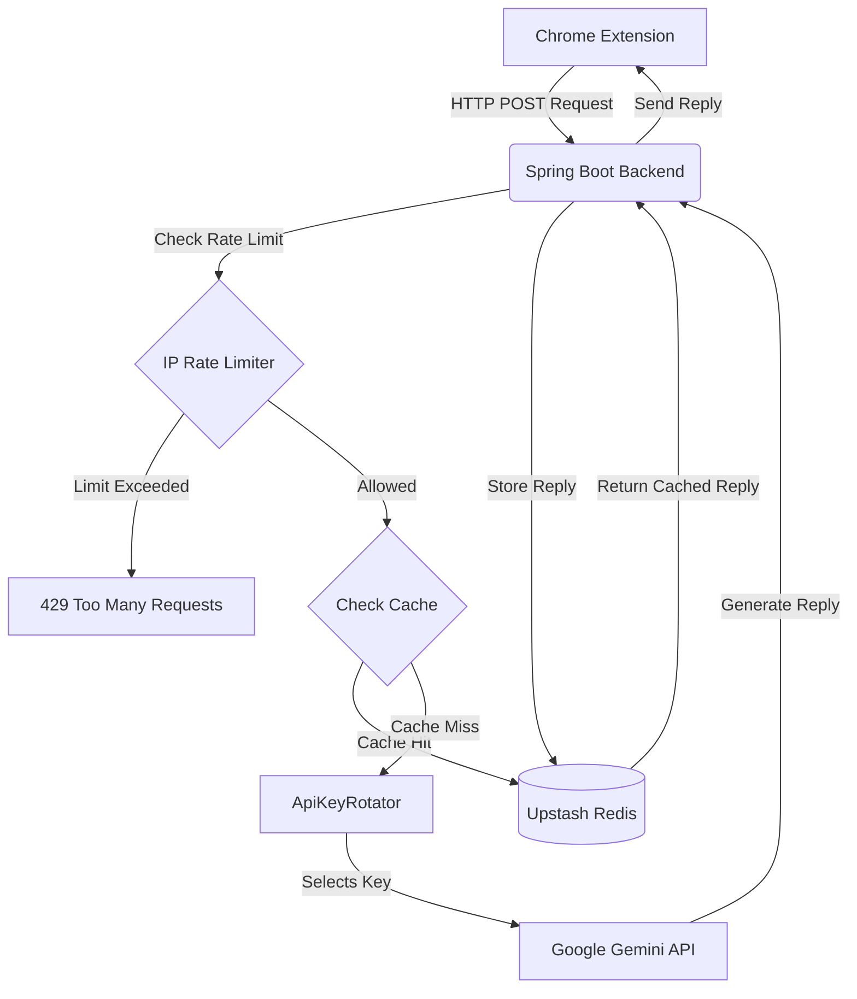

# MailCraft — AI-Powered Chrome Extension ✉️🤖

> Refine selected text into clear, well-structured, and professional email responses — with a single click.

---

## 🎥 Live Demo

🔗 [Watch Demo on YouTube](https://www.youtube.com/watch?v=Eg_3R4pzB3o)

---

## 📌 Overview

**MailCraft** is an AI-powered Chrome extension that helps users generate professional emails instantly. It refines selected text into clear, well-structured, and professional email responses with a single click, saving time and improving productivity.

Whether you're dealing with a flood of work emails or just struggling to find the right words, MailCraft gives you a head start every time.

---

## ✨ Features

- 🧩 **Chrome Extension** — Works directly inside your browser, no tab switching needed
- 🧠 **AI-Powered Replies** — Uses Google Gemini API to generate intelligent, context-aware email responses
- 🎭 **Tone Selection** — Choose from tones like Professional, Friendly, Formal, Casual, and more
- ⚡ **One-Click Generation** — Select your draft text and get a polished reply instantly
- 🔑 **API Key Rotation** — Rotates across multiple Gemini API keys for high availability and rate limit handling
- 🔴 **Redis Caching** — Caches replies via Upstash Redis to reduce API calls and improve response time
- 🐳 **Docker Ready** — Fully containerized backend for easy local setup and deployment
- ☁️ **Deployed on Render** — Backend hosted on Render for reliable availability

---

## 🛠️ Tech Stack

| Layer | Technology | Why It Was Used |
|---|---|---|
| 🖥️ **Backend** | Java 21 + Spring Boot | Spring Boot is the gold standard for building production-grade REST APIs in Java. It offers auto-configuration, embedded server, and a massive ecosystem — perfect for quickly scaffolding a robust backend. |
| 🤖 **AI Engine** | Google Gemini API | Gemini provides state-of-the-art language understanding and generation capabilities. It's free-tier friendly, fast, and produces high-quality text — ideal for generating natural-sounding email replies. |
| 🔴 **Caching** | Upstash Redis | Upstash is a managed, serverless Redis service. It caches email replies so repeated requests are served instantly without hitting the Gemini API again — saving rate limit quota and improving speed. |
| 🐳 **Containerization** | Docker | Docker ensures the app runs identically across all environments. The Dockerfile uses a multi-stage build to keep the final image small and production-ready. |
| ☁️ **Deployment** | Render | Render supports Docker-based deployments out of the box and offers a free tier for hobby projects. The `render.yaml` enables Infrastructure-as-Code style deployments for easy CI/CD. |

---

## 🏗️ Architecture

MailCraft's architecture is designed to handle high loads efficiently by utilizing caching and API key rotation:



1. **Client Layer (Chrome Extension):** The user selects text and requests an email reply with a specific tone.
2. **API Layer (Spring Boot Backend):** The backend receives the request and acts as a central orchestrator. It applies an IP-based rate limiter.
3. **Caching Layer (Upstash Redis):** Before querying the AI model, the backend checks Redis to see if the exact same email content and tone have already been processed. If yes, it returns the cached response, avoiding an AI request.
4. **AI Engine Layer (Gemini API with Key Rotation):** If there is no cache, the `ApiKeyRotator` selects an available Google Gemini API key using a round-robin strategy. If one key is exhausted or hits rate limits, it falls back to the next key.
5. **Response:** The generated email is sent back to the client and simultaneously cached in Redis for future requests.

---

## ⚙️ How It Works

```
User Request (Chrome Extension)
        ↓
Redis Cache? ──HIT──→ Instant reply ✅ (0 API calls used)
        ↓ MISS
ApiKeyRotator picks next key (round-robin)
        ↓
Try Key 1 → fails? → Try Key 2 → fails? → Try Key 3 ✅
        ↓
Gemini API generates reply
        ↓
Store in Redis Cache (TTL: 1 hour)
        ↓
Return reply to user ✅
```

---

## 📂 Project Structure

```
MailCraft/
├── src/
│   └── main/
│       ├── java/
│       │   └── com/example/emailGenerator/
│       │       ├── EmailGeneratorApplication.java   # App entry point
│       │       ├── EmailGeneratorController.java    # REST API controller
│       │       ├── EmailGeneratorService.java       # Core business logic + caching
│       │       ├── ApiKeyRotator.java               # Round-robin key rotation
│       │       ├── RedisConfig.java                 # Redis serialization config
│       │       ├── EmailRequest.java                # Request model
│       │       └── WebController.java               # Web routes
│       └── resources/
│           ├── static/                              # Frontend files
│           ├── templates/                           # Thymeleaf templates
│           └── application.properties              # App configuration
├── .mvn/wrapper/          # Maven wrapper files
├── Dockerfile             # Multi-stage Docker build
├── render.yaml            # Render deployment configuration
├── pom.xml                # Maven dependencies & build config
├── mvnw / mvnw.cmd        # Maven wrapper scripts (Linux/Windows)
└── .gitignore
```

---

## 🚀 Getting Started

### Prerequisites

- Java 17+ (or 21)
- Maven (or use the included `mvnw` wrapper)
- Google Gemini API Keys ([Get one here](https://aistudio.google.com/app/apikey))
- Upstash Redis account ([Sign up here](https://upstash.com))

---

### 🔧 Local Setup (Without Docker)

**1. Clone the repository**
```bash
git clone https://github.com/harshaadeshmukh/MailCraft.git
cd MailCraft
```

**2. Set Environment Variables in IntelliJ**

Go to **Run → Edit Configurations → Environment Variables** and add:
```
GEMINI_API_URL   = https://generativelanguage.googleapis.com
GEMINI_API_KEYS  = your-gemini-api-keys
REDIS_HOST       = your-upstash-host
REDIS_PORT       = 6379
REDIS_PASSWORD   = your-upstash-password
```

**3. Build and run**
```bash
./mvnw spring-boot:run
```
> On Windows, use `mvnw.cmd spring-boot:run`

**4. Open the app**

Navigate to `http://localhost:8080` in your browser.

---


## 🌐 API Reference

### Generate Email Reply

**`POST /api/email/generate`**

**Request Body:**
```json
{
  "emailContent": "Hi, I wanted to follow up on our meeting from last week...",
  "tone": "Professional"
}
```

**Response:**
```json
{
  "reply": "Dear [Name],\n\nThank you for reaching out. I appreciate your follow-up regarding our recent meeting..."
}
```

**Error Response (all keys exhausted):**
```
Status: 503
Body: "⏳ All keys are busy. Please try again in a minute."
```

---

## ☁️ Deployment on Render

**1.** Push your code to GitHub

**2.** Go to [render.com](https://render.com) → **New Web Service** → connect your repo

**3.** Set these environment variables in Render dashboard:
```
GEMINI_API_URL   = https://generativelanguage.googleapis.com
GEMINI_API_KEYS  = your-gemini-api-keys
REDIS_HOST       = your-upstash-host
REDIS_PORT       = 6379
REDIS_PASSWORD   = your-upstash-password
```

**4.** Render auto-builds the Docker image and deploys ✅

---

## 🔑 API Key Rotation — How It Works

MailCraft treats API keys like server instances behind a load balancer — **horizontal scaling applied to API keys.**

```
                  ┌─── Key 1 (15 req/min) ───┐
                  │                           │
Request ──→ ApiKeyRotator ─── Key 2 (15 req/min) ───→ Gemini API
                  │                           │
                  └─── Key 3 (15 req/min) ───┘

Total capacity = 15 req/min × number of keys
```

- Uses `AtomicInteger` for thread-safe round-robin selection
- If one key fails → automatically tries the next key
- More keys = more capacity — completely free ✅

### ⚠️ API Key Limitations
- Please note the API key limitations: **only within 60 seconds we can create request up to 10**. 
- The built-in rate limiter ensures that no single user IP exceeds this limit within the 60-second window, protecting the app from spam and ensuring fairness across all users.

---

## 🔮 Future Improvements

- [ ] Support for Outlook and other email clients
- [ ] Multiple AI model support (OpenAI, Claude, etc.)
- [ ] User authentication and reply history
- [ ] Redis request queue for when all keys are exhausted
- [ ] Key health monitoring with auto-recovery
- [ ] Additional tone options (Empathetic, Assertive, Apologetic)
- [ ] Smart subject line suggestions
- [ ] Publish to Chrome Web Store
- [ ] Kubernetes deployment for 10,000+ users

---

## 🤝 Contributing

Contributions are welcome! Feel free to open an issue or submit a pull request.

1. Fork the repo
2. Create your feature branch: `git checkout -b feature/your-feature`
3. Commit your changes: `git commit -m 'Add your feature'`
4. Push to the branch: `git push origin feature/your-feature`
5. Open a Pull Request

---

## 📄 License

This project is open source. Feel free to use, modify, and distribute it.

---

<div align="center">

Made with ❤️ by Harshad Deshmukh

⭐ Star this repo if you found it helpful!

🚀 Happy Coding! 🎉

</div>
